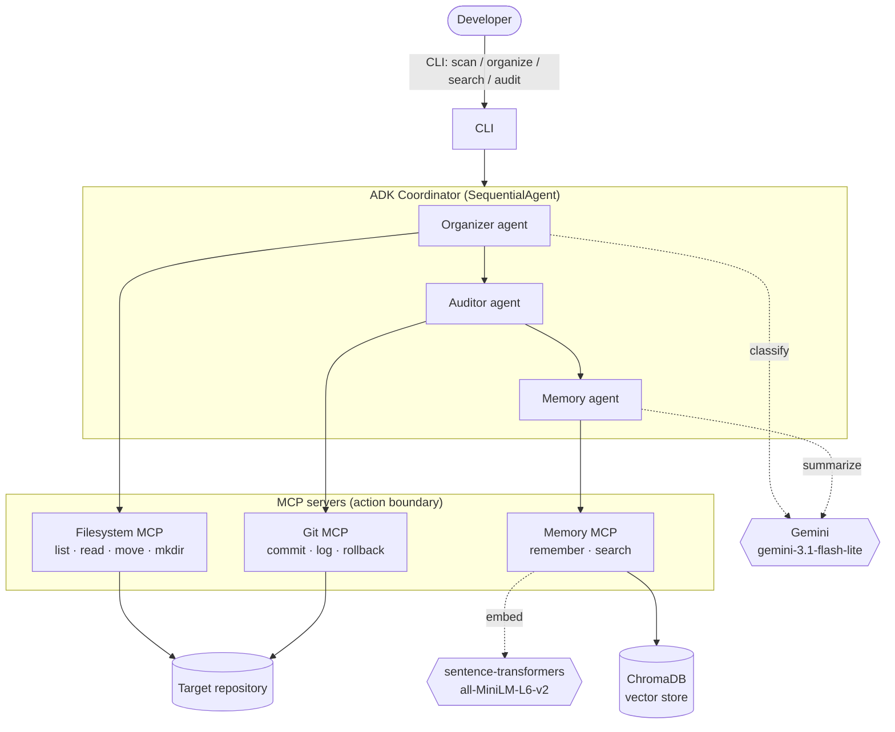
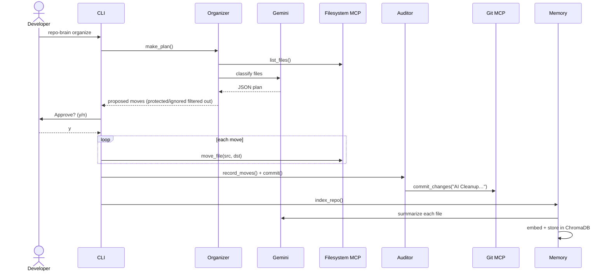

# RepoChange

An agentic "second brain" for a code repository. It cleans up a messy repo the
way a careful engineer would: **propose first, get approval, log everything,
commit through Git, and remember what every file is about** so you can search it
later in plain English.

The tool lives in [`repo-brain/`](./repo-brain) and manages this repository
(`RepoChange`).

---

## The Problem

Repositories rot. Files pile up at the root — notes, half-finished scripts,
data dumps, deprecated docs — until nobody can tell what's where or why. The
usual "fixes" make it worse:

- **Manual cleanup** is slow, inconsistent, and nobody remembers the reasoning.
- **A naive script** that just moves files is dangerous: it can clobber secrets
  like `.env`, move things you didn't want moved, and leaves no trail of what
  happened or how to undo it.
- Even after tidying, **knowledge is still lost** — you can find a file only if
  you already remember its name.

What's missing is a cleanup process that is *automated but trustworthy*:
reviewable, reversible, secret-aware, and one that actually understands the
content it's organizing.

## The Solution

**RepoChange** is a multi-agent system that organizes a repository safely and
builds a searchable memory of it. Three specialized agents run in sequence:

1. **Organizer** — asks Gemini to classify every file into `docs / src / tests /
   data / archive` and proposes a plan. It never moves anything itself.
2. **Auditor** — after you approve, it records each action to an audit log and
   commits the change set through Git.
3. **Memory** — reads each file, has Gemini summarize it, and embeds it into a
   vector store so the repo becomes semantically searchable.

Every filesystem, git, and memory action goes through a dedicated **MCP server**
— agents never call `shutil` or `git` directly. A **dry-run + human approval**
gate and a **protected-paths** policy make it safe to run on a real repo.

```
"RepoChange search 'authentication strategy'"
   → docs/auth_notes.md  ·  "OAuth2 with PKCE was selected because…"
```

---

## How It Works

### Component architecture



### The organize workflow



### Components

| Layer | Location | Responsibility |
|-------|----------|----------------|
| CLI | `repo-brain/cli/main.py` | Typer app: `scan`, `organize`, `search`, `audit`, `rollback`, `index` |
| Coordinator | `repo-brain/agents/coordinator.py` | Builds the ADK `SequentialAgent` and drives the pipeline |
| Agents | `repo-brain/agents/` | `organizer.py`, `auditor.py`, `memory_agent.py` |
| MCP servers | `repo-brain/mcp/` | `filesystem_server.py`, `git_server.py`, `memory_server.py` (FastMCP) |
| Memory | `repo-brain/memory/vector_store.py` | ChromaDB + sentence-transformers embeddings |
| Config | `repo-brain/config.py` | Target repo, model, protected & ignored paths |

Each MCP server is a real FastMCP server (`python mcp/<file>.py` serves over
stdio) and also exposes plain functions the agents import in-process.

---

## Before / After

```
BEFORE (chaos)                          AFTER (organized)
RepoChange/                             RepoChange/
├── auth_notes.md                       ├── docs/
├── auth_notes_v2.md                    │   ├── auth_notes.md
├── design_doc.md                       │   ├── auth_notes_v2.md
├── meeting.txt              organize    │   ├── design_doc.md
├── old_notes.md            ─────────►   │   ├── meeting.txt
├── random.pdf                          │   └── random.pdf
├── script.py                           ├── src/script.py
├── test_script.py                      ├── tests/test_script.py
├── users.json                          ├── data/users.json
├── .env         🔒 protected           ├── archive/old_notes.md
└── repo-brain/  (the tool)             ├── .env         🔒 untouched
                                        └── repo-brain/  (never touched)
```

---

## Setup

Requires Python 3.13 and a Gemini API key.

```bash
cd repo-brain
python3.13 -m venv .venv
.venv/bin/python -m pip install -r requirements.txt
```

Add your Gemini key to a `.env` file at the repo root (it's gitignored):

```bash
# RepoChange/.env
GOOGLE_API_KEY=your-key-here
```

## Usage

Run from the `repo-brain/` directory (the `./repo-brain` launcher uses the venv):

```bash
./repo-brain scan                 # show current layout
./repo-brain organize --dry-run   # propose a plan, change nothing
./repo-brain organize             # propose → "Approve? (y/n)" → apply + commit
./repo-brain organize --auto      # apply without prompting (used by cron)
./repo-brain search "authentication strategy"
./repo-brain audit                # audit log + git history
./repo-brain rollback             # undo repo-brain's last commit (files kept)
./repo-brain index                # rebuild semantic memory only
```

By default it operates on the parent repository, **RepoChange**. Point it at any
other repo with `REPO_BRAIN_TARGET=/path/to/repo ./repo-brain scan`.

## Security Model

- **Dry-run + approval** — nothing moves until you approve the plan.
- **Protected paths** (`config.PROTECTED`) — `.env`, `.git`, `secrets`,
  `credentials` are never moved, enforced at the Filesystem MCP boundary.
- **Ignored paths** (`config.IGNORE`) — the tool's own files (`repo-brain/`,
  `.venv`, `README.md`) are never moved or indexed, so it can run *inside* the
  repo it manages without touching itself.
- **Path confinement** — operations cannot escape the target repo.
- **Audit trail** — every action is appended to `logs/audit.jsonl` and committed.
- **Reversible** — `./repo-brain rollback` undoes the last commit, keeping files.

## Gemini (required)

repo-brain uses Gemini for classification and summaries. Set `GOOGLE_API_KEY`
(or `GEMINI_API_KEY`) in the environment or `.env`. The model defaults to
`gemini-3.1-flash-lite`; override with `REPO_BRAIN_MODEL`. Commands that need the
model (`organize`, `index`) fail with a clear message if no key is configured.

## Automation

`repo-brain/cron/nightly.sh` runs the pipeline unattended. Install with
`crontab -e`:

```
0 2 * * * /Users/risha/source/RepoChange/repo-brain/cron/nightly.sh >> /tmp/repo-brain.log 2>&1
```

## Tech Stack

Google ADK · MCP (FastMCP) · Gemini (`gemini-3.1-flash-lite`) · ChromaDB ·
sentence-transformers · GitPython · Typer · Rich
